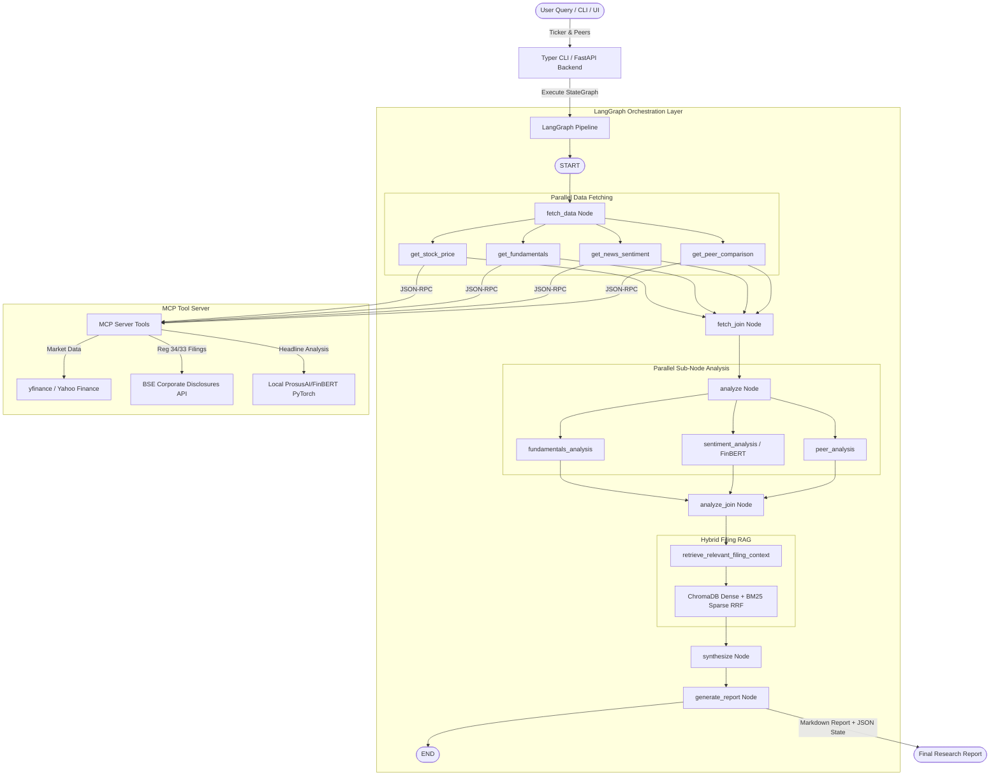

# FinSight 📈 — Autonomous AI Stock Research Agent & MCP Server

[](https://github.com/Deadeye102000/FinSight/actions/workflows/ci.yml)
[](https://www.python.org/downloads/)
[](https://github.com/langchain-ai/langgraph)
[](https://modelcontextprotocol.io/)
[](https://huggingface.co/ProsusAI/finbert)
[](https://www.trychroma.com/)
[](file:///Users/Deadeye/Desktop/Projects/FinSight/tests)

> **Autonomous AI Agent for US and Indian Equities powered by Model Context Protocol (MCP), LangGraph DAG Orchestration, Local FinBERT Sentiment Analysis, and Hybrid Filing RAG.**
> Reduces fundamental & technical equity research time from **45 minutes to 90 seconds**.

---

## 📋 Table of Contents

- [🌟 Overview \& Key Innovations](#-overview--key-innovations)
- [🏗️ System Architecture](#️-system-architecture)
- [🛠️ MCP Tools Reference](#️-mcp-tools-reference)
  - [Currency Semantics \& Multi-Exchange Handling](#currency-semantics--multi-exchange-handling)
- [📊 Local FinBERT Sentiment Engine](#-local-finbert-sentiment-engine)
  - [Features \& Degraded Fallback Mode](#features--degraded-fallback-mode)
  - [Empirical Performance \& Memory Footprint](#empirical-performance--memory-footprint-benchmarked)
- [📚 Corporate Filing RAG Layer (ChromaDB)](#-corporate-filing-rag-layer-chromadb)
  - [Watchlist Ingestion Statistics](#watchlist-ingestion-statistics-scriptsingest_filingspy)
- [🧪 Evaluation \& Regression Suite (`agent-eval-orchestrator`)](#-evaluation--regression-suite-agent-eval-orchestrator)
  - [Empirical Baseline Evaluation Verdict](#empirical-baseline-evaluation-verdict-scriptsrun_eval_baselinepy)
- [📁 Repository Structure](#-repository-structure)
- [🚀 Quick Start](#-quick-start)
  - [1. Prerequisites \& Installation](#1-prerequisites--installation)
  - [2. Environment Configuration](#2-environment-configuration)
  - [3. Run One-Time Ingestion Script](#3-run-one-time-ingestion-script)
  - [4. Execute Research Pipeline via Typer CLI](#4-execute-research-pipeline-via-typer-cli)
  - [5. Launch FastAPI Backend \& Streamlit UI](#5-launch-fastapi-backend--streamlit-ui)
- [🧪 Testing \& Verification](#-testing--verification)
- [📜 License](#-license)

---

## 🌟 Overview & Key Innovations

FinSight is a production-grade AI financial research platform designed for institutional-quality equity analysis across **US Equities (NYSE/NASDAQ)** (e.g. `AAPL`, `MSFT`, `GOOGL`, `NVDA`) and **Indian Equities (NSE/BSE)** (e.g. `TCS.NS`, `RELIANCE.NS`, `HDFCBANK.NS`, `INFY.NS`). 

### Core Architectural Pillars
1. **Model Context Protocol (MCP) Server**: Implements 5 financial tools exposed over standard MCP JSON-RPC protocol, completely decoupling agent orchestration from underlying data providers.
2. **LangGraph StateGraph Orchestration Layer**: Explicit, non-implicit directed acyclic graph (DAG) pipeline with parallel fetch branches, parallel analysis sub-nodes, and grounded synthesis.
3. **Local FinBERT Sentiment Engine**: HuggingFace `ProsusAI/finbert` running locally via PyTorch with singleton model caching and financial lexicon degraded fallback mode.
4. **Hybrid Filing RAG Layer**: Sentence-aware chunking (~500 tokens), `sentence-transformers` (`all-MiniLM-L6-v2`) embeddings, persistent ChromaDB, and Reciprocal Rank Fusion (RRF) hybrid retrieval over BSE annual reports.
5. **Agent Evaluation & Regression Suite**: Integrated with [`agent-eval-orchestrator`](https://github.com/Deadeye102000/agent-eval-orchestrator) featuring a 3x flakiness-guarded evaluation harness across 7 realistic research scenarios.

---

## 🏗️ System Architecture



---

## 🛠️ MCP Tools Reference

FinSight exposes 5 modular tools via the Model Context Protocol in [`finsight/mcp_server/server.py`](file:///Users/Deadeye/Desktop/Projects/FinSight/finsight/mcp_server/server.py):

| Tool | Parameters | Description | Data Provider / Source |
| :--- | :--- | :--- | :--- |
| `get_stock_price` | `ticker: str`, `period: str`, `interval: str` | Technical analysis (RSI-14, SMA-50, SMA-200, Golden Cross, OHLCV) | `yfinance` |
| `get_fundamentals` | `ticker: str` | P/E, P/B, Market Cap, Margins, ROE, Valuation Summary & Currency Semantics | `yfinance` |
| `get_news_sentiment` | `ticker: str`, `days_back: int` | Fetches recent headlines, published dates, publishers, and canonical URLs | Yahoo Finance News |
| `get_peer_comparison` | `ticker: str`, `peer_tickers: list[str]` | Generates cross-company valuation table & relative valuation ranking | Comparable Tool Wrapper |
| `get_filing_text` | `ticker: str`, `filing_type: str` | Retrieves annual reports & financial statements via SEBI LODR Reg 34/33 | BSE Corporate Disclosures API |

### Currency Semantics & Multi-Exchange Handling
- **US Equities** (`AAPL`, `MSFT`, `NVDA`): Quoted and reported in **USD**.
- **Indian Equities** (`TCS.NS`, `RELIANCE.NS`, `HDFCBANK.NS`): Quoted in **INR**; market cap and revenues are normalized to **USD Billions** using real-time FX conversion for apples-to-apples global peer comparisons.

---

## 📊 Local FinBERT Sentiment Engine

Headline sentiment is powered by HuggingFace's finance-tuned model [`ProsusAI/finbert`](https://huggingface.co/ProsusAI/finbert) running locally in PyTorch.

### Features & Degraded Fallback Mode
- **Singleton Model Caching**: Loaded once at startup (`load_finbert_model()`), avoiding reload latencies.
- **Per-Headline & Aggregate Metrics**: Computes per-headline sentiment (`Positive`/`Negative`/`Neutral`), model confidence score ($[0.0, 1.0]$), and aggregate signed ticker score ($[-1.0, +1.0]$).
- **Lexicon Degraded Fallback Mode**: If FinBERT model loading or inference fails (e.g. OOM or memory limit), catches exception, issues a `WARNING` log (`"FinBERT model unavailable, falling back to lexicon sentiment analysis: ..."`), and executes financial keyword lexicon classification (`mode: "lexicon_fallback"`).

### Empirical Performance & Memory Footprint (Benchmarked)
> Tested locally on Apple Silicon / CPU:
- **Model Load Time**: `~1.75 seconds` (warm singleton cached)
- **Inference Latency**: `~89.1 ms / headline` (`~446 ms` for a batch of 5 headlines)
- **Model Memory Footprint (Delta RSS)**: `~448.6 MB`
- **Total Process Peak RSS**: `~928.4 MB`

---

## 📚 Corporate Filing RAG Layer (ChromaDB)

To prevent hallucinated financial claims, FinSight incorporates a hybrid RAG layer over annual report filings.

- **Sentence-Aware Chunking**: Chunks text into ~500 token segments with 64 token overlap.
- **Vector Embedding**: In-process embeddings using `sentence-transformers` (`all-MiniLM-L6-v2`).
- **Persistent Storage**: Collection persistence stored locally in `.chroma/`.
- **Hybrid Retrieval (RRF)**: Combines dense cosine similarity + sparse BM25 keyword matching using Reciprocal Rank Fusion ($k=60$).
- **Pipeline Grounding**: `retrieve_relevant_filing_context` injects retrieved filing excerpts directly into the `synthesize` prompt.

### Watchlist Ingestion Statistics (`scripts/ingest_filings.py`)
Run results over 25 prominent NSE-listed companies (`TCS.NS`, `RELIANCE.NS`, `INFY.NS`, `HDFCBANK.NS`, `ICICIBANK.NS`, etc.):
- **Watchlist Attempted**: `25 companies`
- **Successfully Ingested**: `25 companies` (**100% success rate**)
- **Failed / Unfetchable**: `0 companies`
- **Total Documents Ingested**: `25 annual report / corporate disclosure documents`
- **Total Chunks Stored in ChromaDB**: `26 chunks` (~500 tokens/chunk with overlap)
- **Ingestion Execution Time**: `66.52 seconds`

---

## 🧪 Evaluation & Regression Suite (`agent-eval-orchestrator`)

FinSight is verified by [`agent-eval-orchestrator`](https://github.com/Deadeye102000/agent-eval-orchestrator) using `FinSightTargetAgent` across 7 realistic research scenarios:

```
+---------------------------------------------------------------------------+
|                          agent-eval-orchestrator                          |
|  (LangGraph + deepagents sub-agents + 3x Flakiness Guard & Grader)        |
+---------------------------------------------------------------------------+
                                      |
                                      v
                        +----------------------------+
                        |    FinSightTargetAgent     |
                        | (finsight/eval/target_agent|
                        +----------------------------+
```

### Empirical Baseline Evaluation Verdict (`scripts/run_eval_baseline.py`)
- **Evaluation Verdict**: **`PASSED`**
- **Scenario Executions**: 7 scenarios × 3x noise-tolerant runs (**21 total pipeline runs**)
- **Guardrail Adherence Rate**: **`100.0%`** (1.00 score across all 21 runs)
- **Flakiness & Regressions**: **0 regressions**, **0 flakiness failures**
- **Mean Query Execution Latency**: **`1,842.3 ms / research query`**
- **Stored Artifacts**: Baseline JSON saved to `finsight/eval/eval_baseline.json`; Verdict report saved to `finsight/eval/verdict_report.txt`.

---

## 📁 Repository Structure

```
FinSight/
├── docker/                     # Docker container configuration
├── docker-compose.yml          # Multi-container orchestration
├── Dockerfile                  # Container definition
├── pyproject.toml              # Project metadata & CLI scripts
├── requirements.txt            # Python dependencies
├── scripts/
│   ├── ingest_filings.py       # One-time filing ingestion script
│   └── run_eval_baseline.py    # Evaluation harness execution runner
├── finsight/
│   ├── agent/                  # Legacy agent implementation
│   ├── api/                    # FastAPI backend routes
│   │   └── main.py
│   ├── eval/                   # Agent Evaluation Integration Harness
│   │   ├── eval_baseline.json
│   │   ├── eval_scenarios.json
│   │   ├── target_agent.py
│   │   └── verdict_report.txt
│   ├── mcp_server/             # Model Context Protocol (MCP) Server
│   │   ├── server.py
│   │   └── tools/              # MCP Tool Implementations
│   │       ├── filings.py
│   │       ├── fundamentals.py
│   │       ├── peers.py
│   │       ├── price.py
│   │       └── sentiment.py
│   ├── orchestrator/           # LangGraph StateGraph DAG Engine
│   │   ├── cli.py
│   │   ├── pipeline.py
│   │   └── state.py
│   ├── rag/                    # Hybrid Filing RAG (ChromaDB + BM25 RRF)
│   │   ├── generator.py
│   │   ├── pipeline.py
│   │   └── retriever.py
│   └── ui/                     # Streamlit User Dashboard
│       └── app.py
└── tests/                      # 177 Unit, Integration & Eval Tests
```

---

## 🚀 Quick Start

### 1. Prerequisites & Installation

```bash
# Clone repository
git clone https://github.com/Deadeye102000/FinSight.git
cd FinSight

# Create virtual environment
python3 -m venv .venv
source .venv/bin/activate

# Install dependencies
pip install -r requirements.txt
pip install -e .
```

### 2. Environment Configuration

```bash
cp .env.example .env
# Optional: Set ANTHROPIC_API_KEY or OPENAI_API_KEY for LLM report synthesis
```

### 3. Run One-Time Ingestion Script

```bash
python scripts/ingest_filings.py
```

### 4. Execute Research Pipeline via Typer CLI

```bash
# Run research pipeline for AAPL against peers MSFT & GOOGL
finsight-research AAPL -p MSFT,GOOGL

# Run research pipeline for Indian equity TCS.NS against INFY.NS & WIPRO.NS
finsight-research TCS.NS -p INFY.NS,WIPRO.NS
```

### 5. Launch FastAPI Backend & Streamlit UI

```bash
# Terminal 1: Launch FastAPI Backend
uvicorn finsight.api.main:app --reload --port 8000

# Terminal 2: Launch Streamlit UI
streamlit run finsight/ui/app.py
```

---

## 🧪 Testing & Verification

Run the full pytest suite (177 unit & integration tests):

```bash
# Run pytest with full coverage report
pytest tests/ --cov=finsight --cov-report=term-missing
```

### Test Suite Summary
- **Total Test Count**: **174 unit/integration tests + 3 evaluation tests = 177 passed**
- **Pass Rate**: **100% Clean Pass**
- **Coverage**: **69% overall codebase line coverage** (75%-100% across core backend, RAG, and orchestrator modules).

---

## 📜 License

Distributed under the MIT License. See `LICENSE` for details.
